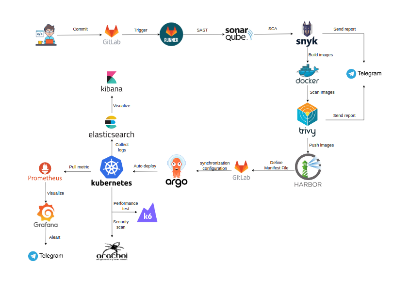
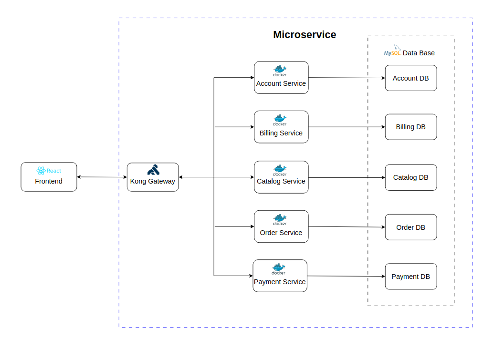
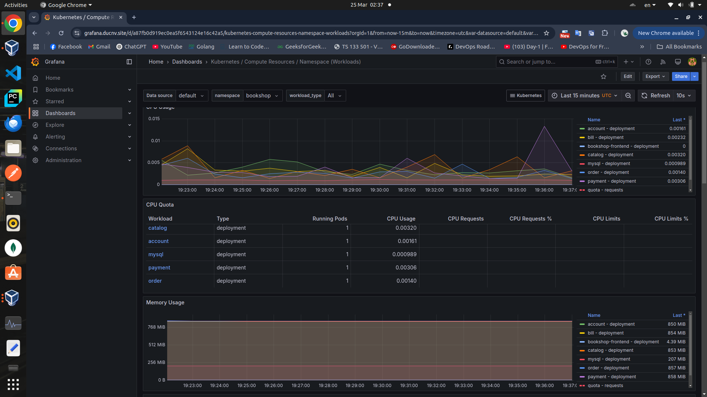
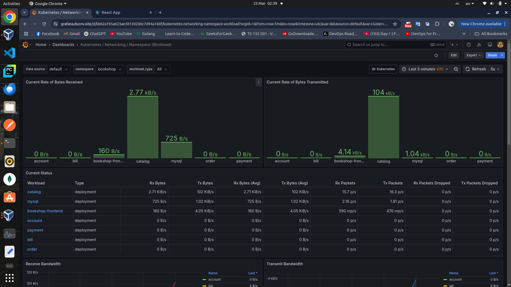
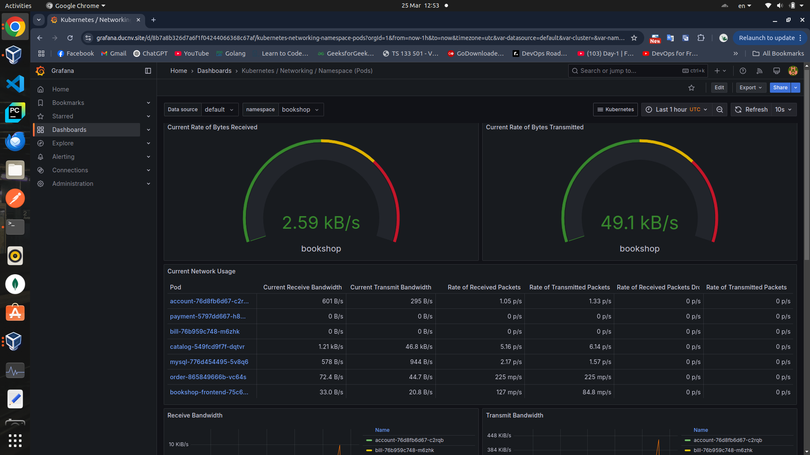
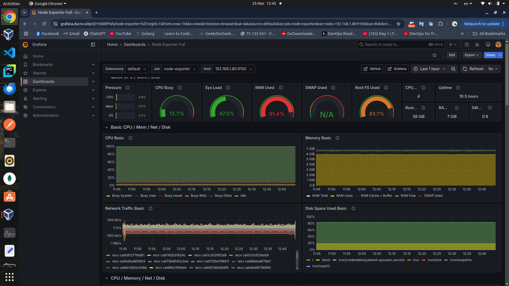
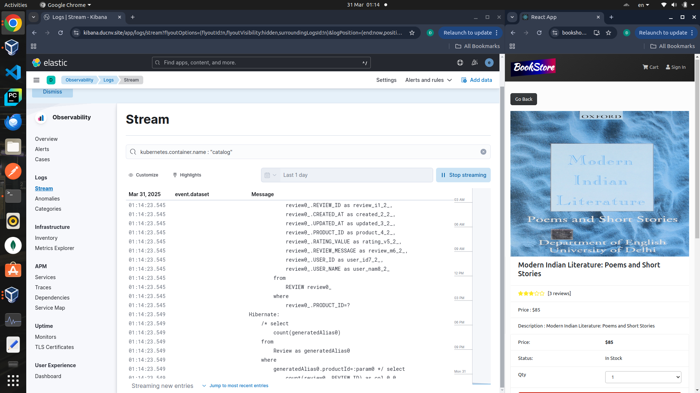

# MicroBookstore - Cloud Native Bookstore 

<hr>

## About this project
The MicroBookstore is a microservices-based project designed for flexible management and scalability on Kubernetes (K8s). It incorporates a CI/CD DevSecOps model (Continuous Integration, Continuous Deployment, and Security Operations) to streamline workflows, reduce deployment time, and enhance security by identifying vulnerabilities in both source code and infrastructure.  

<p align="center">
  
</p>

The system includes a CI/CD pipeline using GitLab CI, integrated with tools for source code and container image testing. Additionally, Prometheus and Grafana are used for performance monitoring, while the ELK stack provides centralized logging for effective troubleshooting and analysis.

## Table of Contents
- [MicroBookstore - Cloud Native Bookstore](#microbookstore---cloud-native-bookstore)
  - [About this project](#about-this-project)
  - [Table of Contents](#table-of-contents)
  - [Architecture](#architecture)
    - [Frontend:](#frontend)
    - [Kong Gateway:](#kong-gateway)
    - [Microservices:](#microservices)
    - [Database (MySQL):](#database-mysql)
  - [Frontend Checkout Flow](#frontend-checkout-flow)
  - [Run this project in Kubernetes](#run-this-project-in-kubernetes)
  - [Continuous Integration (CI) with GitLab](#continuous-integration-ci-with-gitlab)
  - [Continuous Deployment with ArgoCD](#continuous-deployment-with-argocd)
    - [Overviews](#overviews)
    - [Kubernetes Resources](#kubernetes-resources)
    - [Automated Deployment with ArgoCD](#automated-deployment-with-argocd)
    - [Benefits of Using GitLab + ArgoCD](#benefits-of-using-gitlab--argocd)
  - [Security and performance testing](#security-and-performance-testing)
  - [Monitoring](#monitoring)


## Architecture

The architecture of this project is a Microservices-based system deployed using Kong Gateway as the API Gateway to route requests from the React Frontend to individual services. The key components of the system include:

### Frontend:
The React application serves as the user interface, allowing users to interact with the system. It sends HTTPS requests to the backend services, which are routed and managed by Kong Gateway, ensuring secure, scalable, and efficient communication between the frontend and the backend.

### Kong Gateway:
- Acts as an API Gateway, responsible for routing requests from the frontend to the appropriate Microservices.

- Provides security, load balancing, and API management.

<p align="center">
  
</p>

### Microservices:
The system follows a microservices architecture, where each service handles a specific functionality:

- Account Service: Manages user accounts.

- Billing Service: Handles invoices and payments.

- Catalog Service: Manages product catalogs.

- Order Service: Processes customer orders.

- Payment Service: Handles payment transactions.

Each service runs in a Docker container, ensuring flexibility and scalability.
### Database (MySQL):
Each microservice has its own dedicated database to ensure independence. This project deploys MySQL on Kubernetes using **StatefulSet**, providing stable data management and seamless scalability.

<hr>

## Frontend Checkout Flow


<hr>

## Run this project in Kubernetes

... The project will be updated with installation instructions using Helm. ...

```
Api Gateway Service       : 8765
Eureka Discovery Service  : 8761
Consul Discovery          : 8500
Account Service           : 4001
Billing Service           : 5001
Catalog Service           : 6001
Order Service             : 7001
Payment Service           : 8001
```

<hr>

## Continuous Integration (CI) with GitLab
CI/CD pipeline using GitLab, Kubernetes, ArgoCD, security scanning tools, performance test, monitoring, and logging solutions. The process follows these key stages:

1. Code Commit and Triggering the Pipeline
   - A developer commits code changes to GitLab.

   - This triggers a GitLab Runner, which initiates the CI/CD process
  
2. Static Code Analysis (SAST) and Software Composition Analysis (SCA)
   - SonarQube performs Static Application Security Testing (SAST) to analyze the code for vulnerabilities.

   - Snyk performs Software Composition Analysis (SCA) to check for security issues in dependencies.
3. Container Image Building and Security Scanning
   - The code is built into a Docker image.

   - Trivy scans the Docker image for vulnerabilities.

   - The secure image is pushed to Harbor (Container Registry).

Video demo

https://github.com/user-attachments/assets/14ee2e57-0c6d-427a-9f8a-f28f18609d2a

## Continuous Deployment with ArgoCD
### Overviews
After completing the CI (Continuous Integration) process, I built and pushed Docker images for each microservice to a container registry. To deploy the project in a Kubernetes environment, I defined the required configurations using manifest files.

### Kubernetes Resources
The project includes the following Kubernetes resources:
- Secret & ConfigMap: Store configuration information and sensitive data.
- Deployment: Declare and manage the lifecycle of services.

- Service: Define how services communicate within the cluster.

- Ingress: Configure access routes from external sources to services within the cluster.

- PersistentVolume (PV) & PersistentVolumeClaim (PVC): Manage persistent storage for services.

All these manifest files are stored in a GitLab repository for version control and easy management.

### Automated Deployment with ArgoCD

To enable automated deployment when there were changes in the manifest files, I used ArgoCD, a GitOps tool that supports Continuous Deployment (CD). ArgoCD monitored the GitLab repository containing the manifest files and automatically updated the application state in Kubernetes whenever changes occurred.

Workflow:

1. Commit changes to GitLab

- When modifying a manifest file (e.g., updating an image version, changing service configurations, modifying ingress rules, etc.), I push the changes to the GitLab repository.

2. ArgoCD detects changes

- ArgoCD continuously watches the repository and synchronizes the cluster state with the updated configurations.

3. Application deployment

- ArgoCD automatically applies the changes to the Kubernetes cluster, ensuring the deployment stays up-to-date without manual intervention.

Video demo:

https://github.com/user-attachments/assets/3aae98c0-c7ba-48f2-966e-d577aa57722f

### Benefits of Using GitLab + ArgoCD

✔ Fully automates the deployment process, eliminating the need for manual operations.

✔ Enables easy rollback in case of issues by tracking change history in Git.

✔ Ensures high consistency, keeping the deployment environment aligned with the declared configurations.

✔ Simplifies version management, making it easy to monitor and control changes.

By combining GitLab and ArgoCD, I can deploy microservices applications in a flexible, fast, and reliable manner on Kubernetes. 🚀


<!--  -->

<hr>

## Security and performance testing
After deploying the website, I performed security scanning and performance testing to ensure the system was secure and operated efficiently.

- Security Scan: Detected and mitigated security vulnerabilities, protecting the website from attacks such as SQL Injection, XSS, and CSRF. It also checked system configurations, ensured compliance with security standards, and prevented malware threats.

- Performance Testing: Assessed load capacity, optimized performance, identified system limitations, and ensured stable operation even under high traffic.

In this project, I integrated Arachni (for security scanning) and K6 (for performance testing) into the pipeline after building and deploying the frontend. K6 supported various testing scenarios, including load testing, stress testing, smoke testing, and soak testing. However, to maintain an efficient pipeline, this project focused on smoke testing to verify the website’s validity.

While automated testing enhanced efficiency, it could not completely replace manual testing. Therefore, I also integrated Prometheus, Node Exporter, and Grafana for monitoring, analyzing, and defining appropriate resource limits for each service.

Video demo:

https://github.com/user-attachments/assets/ba437b94-dce3-438e-bc0c-54e5ef88038e

<hr>

## Monitoring
To monitor the detailed resource usage of the Kubernetes cluster, project used the PNG stack (Prometheus, Grafana, Node Exporter, etc.). Meanwhile, for log collection and analysis, project used the ELK stack (Elasticsearch, Logstash, Kibana).
1. PNG Stack (Prometheus, Node Exporter, Grafana)
   - **Prometheus**: Collects and stores monitoring data using a pull model.
   - **Node Exporter**: Gathers system metrics (CPU, RAM, Disk, Network).
   - **Grafana**: Visualizes Prometheus data through dashboards.

    ➡ **Used for monitoring system performance and resources in Kubernetes.**

2. ELK Stack (Elasticsearch, Logstash, Kibana)
   - **Elasticsearch**: Stores, searches, and analyzes logs.
   - **Logstash**: Collects, processes, and sends logs to Elasticsearch.
   - **Kibana**: Provides a UI for visualizing logs and data analysis.

    ➡ **Used for log collection, processing, and analysis in Kubernetes.**

Video demo

https://github.com/user-attachments/assets/3a52aab1-a543-45a4-bb38-f2caad844d9c

<hr>

**Screenshots of Grafana.**


<hr>

<hr>

<hr>

<hr>

**Screenshots of Monitoring in ELK.**


<hr>

> Account Service

To Get `access_token` for the user, you need `clientId` and `clientSecret`

```
clientId : '93ed453e-b7ac-4192-a6d4-c45fae0d99ac'
clientSecret : 'client.devd123'
```

There are 2 users in the system currently. 
ADMIN, NORMAL USER

```
Admin 
userName: 'admin.admin'
password: 'admin.devd123'
```

```
Normal User 
userName: 'devd.cores'
password: 'cores.devd123'
```

*To get the accessToken (Admin User)* 

```curl 93ed453e-b7ac-4192-a6d4-c45fae0d99ac:client.devd123@localhost:4001/oauth/token -d grant_type=password -d username=admin.admin -d password=admin.devd123```

<hr>
