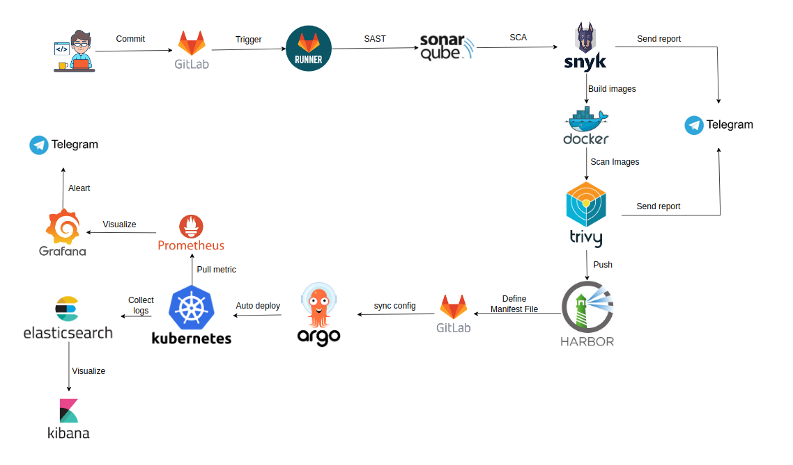

# BookStoreApp-Distributed-Application 

<hr>

## About this project
BookStoreApp Distributed Application is a project developed using a Microservices architecture, designed for flexible management and scaling on Kubernetes (K8S). The project implements a CI/CD DevSecOps model to enhance workflow efficiency, reduce deployment time, and detect security vulnerabilities in both source code and infrastructure.  

<p align="center">
  
</p>

The system includes a CI/CD pipeline using GitLab CI, integrated with tools for source code and container image testing. Additionally, Prometheus and Grafana are used for performance monitoring, while the ELK stack provides centralized logging for effective troubleshooting and analysis.


## Architecture
<p align="center">
  
</p>

The architecture of this project is a Microservices-based system deployed using Kong Gateway as the API Gateway to route requests from the React Frontend to individual services. The key components of the system include:

### Frontend:
The React application serves as the user interface, sending HTTP requests to the backend system through Kong Gateway.

### Kong Gateway:
- Acts as an API Gateway, responsible for routing requests from the frontend to the appropriate Microservices.

- Provides security, load balancing, and API management.
### Microservices:
The system follows a microservices architecture, where each service handles a specific functionality:

- Account Service: Manages user accounts.

- Billing Service: Handles invoices and payments.

- Catalog Service: Manages product catalogs.

- Order Service: Processes customer orders.

- Payment Service: Handles payment transactions.

Each service runs in a Docker container, ensuring flexibility and scalability.
### Database (MySQL):
Each microservice has its own dedicated database, ensuring independence and scalability.


<hr>

## Frontend Checkout Flow


<hr>

## Run this project in Kubernetes


```
Api Gateway Service       : 8765
Eureka Discovery Service  : 8761
Consul Discovery          : 8500
Account Service           : 4001
Billing Service           : 5001
Catalog Service           : 6001
Order Service             : 7001
Payment Service           : 8001
```

<hr>

## Continuous Integration (CI) with GitLab
CI/CD pipeline using GitLab, Kubernetes, ArgoCD, security scanning tools, monitoring, and logging solutions. The process follows these key stages:

1. Code Commit and Triggering the Pipeline
   - A developer commits code changes to GitLab.

   - This triggers a GitLab Runner, which initiates the CI/CD process
  
2. Static Code Analysis (SAST) and Software Composition Analysis (SCA)
   - SonarQube performs Static Application Security Testing (SAST) to analyze the code for vulnerabilities.

   - Snyk performs Software Composition Analysis (SCA) to check for security issues in dependencies.
3. Container Image Building and Security Scanning
   - The code is built into a Docker image.

   - Trivy scans the Docker image for vulnerabilities.

   - The secure image is pushed to Harbor (Container Registry).

https://github.com/user-attachments/assets/14ee2e57-0c6d-427a-9f8a-f28f18609d2a

## Continuous Deployment with ArgoCD
### Overviews
After completing the CI (Continuous Integration) process, I built and pushed Docker images for each microservice to a container registry. To deploy the project in a Kubernetes environment, I defined the required configurations using manifest files.

### Kubernetes Resources
The project includes the following Kubernetes resources:
- Secret & ConfigMap: Store configuration information and sensitive data.
- Deployment: Declare and manage the lifecycle of services.

- Service: Define how services communicate within the cluster.

- Ingress: Configure access routes from external sources to services within the cluster.

- PersistentVolume (PV) & PersistentVolumeClaim (PVC): Manage persistent storage for services.

All these manifest files are stored in a GitLab repository for version control and easy management.

### Automated Deployment with ArgoCD

To enable automated deployment when there are changes in the manifest files, I use ArgoCD, a GitOps tool that supports Continuous Deployment (CD). ArgoCD monitors the GitLab repository containing the manifest files and automatically updates the application state in Kubernetes whenever changes occur.

Workflow:

1. Commit changes to GitLab

- When modifying a manifest file (e.g., updating an image version, changing service configurations, modifying ingress rules, etc.), I push the changes to the GitLab repository.

2. ArgoCD detects changes

- ArgoCD continuously watches the repository and synchronizes the cluster state with the updated configurations.

3. Application deployment

- ArgoCD automatically applies the changes to the Kubernetes cluster, ensuring the deployment stays up-to-date without manual intervention.

### Benefits of Using GitLab + ArgoCD

✅ Fully automates the deployment process, eliminating the need for manual operations.

✅ Enables easy rollback in case of issues by tracking change history in Git.

✅ Ensures high consistency, keeping the deployment environment aligned with the declared configurations.

✅ Simplifies version management, making it easy to monitor and control changes.

By combining GitLab and ArgoCD, I can deploy microservices applications in a flexible, fast, and reliable manner on Kubernetes. 🚀


<!--  -->


<hr>

## Monitoring
I setup PNG Stack & ELK Stack on Kubernetes

1. PNG Stack (Prometheus, Node Exporter, Grafana)
   - **Prometheus**: Collects and stores monitoring data using a pull model.
   - **Node Exporter**: Gathers system metrics (CPU, RAM, Disk, Network).
   - **Grafana**: Visualizes Prometheus data through dashboards.

    ➡ **Used for monitoring system performance and resources in Kubernetes.**

2. ELK Stack (Elasticsearch, Logstash, Kibana)
   - **Elasticsearch**: Stores, searches, and analyzes logs.
   - **Logstash**: Collects, processes, and sends logs to Elasticsearch.
   - **Kibana**: Provides a UI for visualizing logs and data analysis.

    ➡ **Used for log collection, processing, and analysis in Kubernetes.**


<hr>

**Screenshots of Grafana.**


<hr>

<hr>

<hr>

<hr>

**Screenshots of Monitoring in Chronograf(TICK).**


<hr>

> Account Service

To Get `access_token` for the user, you need `clientId` and `clientSecret`

```
clientId : '93ed453e-b7ac-4192-a6d4-c45fae0d99ac'
clientSecret : 'client.devd123'
```

There are 2 users in the system currently. 
ADMIN, NORMAL USER

```
Admin 
userName: 'admin.admin'
password: 'admin.devd123'
```

```
Normal User 
userName: 'devd.cores'
password: 'cores.devd123'
```

*To get the accessToken (Admin User)* 

```curl 93ed453e-b7ac-4192-a6d4-c45fae0d99ac:client.devd123@localhost:4001/oauth/token -d grant_type=password -d username=admin.admin -d password=admin.devd123```

<hr>
